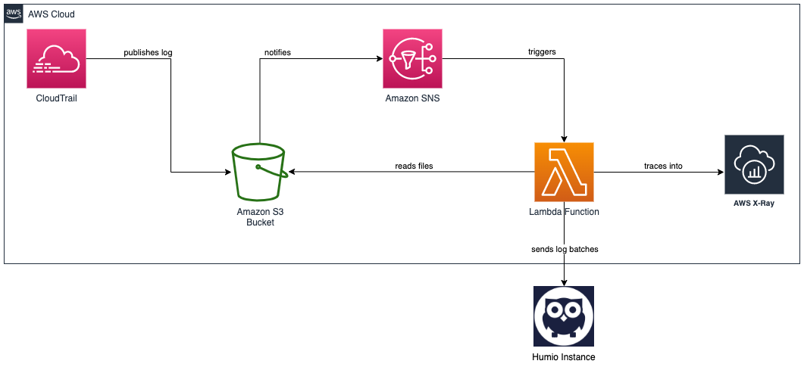

# Humio ingest from AWS Cloud Trail using AWS Lambda

 * *AWS Cloud Trail* records and tracks all application programing interface (API) requests in your AWS Account.
 * *Humio* is modern log management with streaming observability and affordable limited plans
 * This repo presents a lambda function to ingest data from AWS Cloud Trail to Humio
 
### Description of the solution

AWS CloudTrail can be configured to deliver logs to S3 bucket. Log files are typically delivered every 5 minutes. SNS notification is sent when new log appears in the S3 bucket. The notification triggers a run of lambda function. Lambda function then reads the said log file from S3 bucket, and sends its content to Humio.
